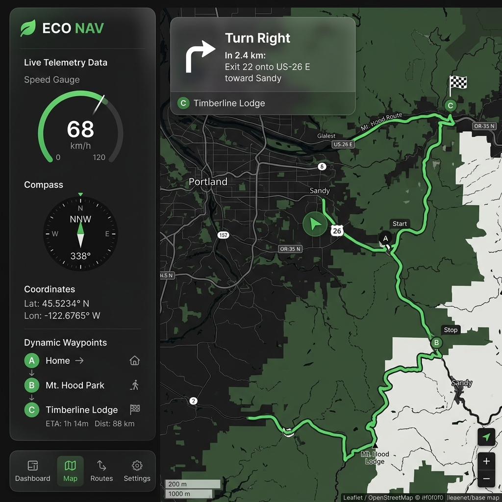
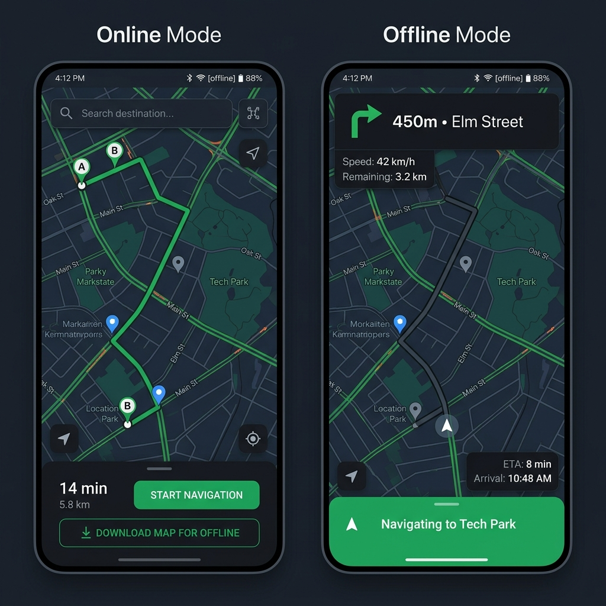

<div align="center">

# 🧭 TrailSync

### Offline-First GPS Navigation System

*Plan routes online. Navigate offline. No signal? No problem.*

[](https://vitejs.dev)
[](https://leafletjs.com)
[](#)
[](#license)

<!-- <br/>



<br/> -->

**TrailSync** is a Progressive Web App that lets you plan routes with real-time road data, download everything for offline use, and navigate with turn-by-turn directions — all from your browser. Built as an IoT project, it integrates with **ESP32 + NEO-6M GPS** hardware for real-world navigation.

<br/>

[Getting Started](#-getting-started) · [Features](#-features) · [How It Works](#-how-it-works) · [Hardware Setup](#-hardware-setup) · [Deploy](#-deployment) · [Developer Guide](docs/DEVELOPER_GUIDE.md)

</div>

---

## 🎯 The Problem

You're hiking a trail, cycling through a new city, or driving through a rural area. Your phone loses signal. Google Maps stops working. You're stuck.

**TrailSync solves this** by letting you pre-download everything you need — map tiles, road networks, turn instructions, and nearby POIs — into your browser's local storage. When you go offline, navigation continues seamlessly.

---

## ✨ Features

<div align="center">

</div>

<br/>

### 🌐 Online Mode — Route Planning
- 🔍 **Place Search** — Find any location worldwide via Nominatim
- 📍 **Click-to-Add Waypoints** — Click the map or search to build your route
- 🚗 **Multi-Mode Routing** — Car, Bike, and Walking profiles via OSRM
- 🛣️ **Snap to Roads** — Aligns waypoints to actual road networks
- 🔀 **Drag & Drop Reorder** — Rearrange waypoints effortlessly
- 📊 **Route Summary** — Distance, estimated time, and turn count

### 📥 One-Click Download
- 🗺️ **Map Tiles** — Cached at multiple zoom levels for the route corridor
- 🕸️ **Road Graph** — Full network for offline rerouting (A* pathfinding)
- 🧭 **Turn Instructions** — Pre-computed maneuvers with custom bearing engine
- 📍 **POI Data** — Nearby fuel stations, restaurants, hospitals
- 📦 **Storage Dashboard** — See exactly how much space each route uses

### 📡 Offline Mode — Turn-by-Turn Navigation
- ➡️ **Navigation HUD** — Maneuver icons, distance to next turn, street names
- 🗣️ **Voice Announcements** — Spoken directions at 200m, 100m, and at each turn
- 📈 **Live Telemetry** — Speed, heading, coordinates, elevation, satellite count
- ⏱️ **ETA & Stats** — Remaining distance and estimated arrival time
- ⚠️ **Off-Route Detection** — Automatic rerouting using cached A* graph
- 🚨 **Speed Alerts** — Configurable speed limit with visual warnings
- 🌙 **Dark Mode** — Night-friendly theme with localStorage persistence

### 🔌 IoT / Hardware Integration
- 📶 **ESP32 WiFi** — WebSocket connection to GPS module with auto-reconnect
- 📲 **Bluetooth BLE** — Web Bluetooth support for direct serial GPS
- 🔋 **Hardware Diagnostics** — Battery, signal, firmware, uptime monitoring
- 🎮 **Built-in Simulator** — Test without hardware using synthetic GPS data

### 📁 Data Management
- 💾 **Export/Import** — Save routes as GeoJSON or GPX, import from other apps
- 📜 **Trip History** — Completed trips with distance, duration, and avg speed
- 🧹 **Tile Purge** — Free storage by removing tiles but keeping route data
- 🏷️ **Auto-Named Routes** — Reverse-geocoded start → end naming

---

## 🔧 How It Works

```
  ┌─────────────┐     ┌──────────────┐     ┌───────────────┐
  │  1. PLAN    │────▶│  2. DOWNLOAD │────▶│  3. NAVIGATE  │
  │  (Online)   │     │  (One-Click) │     │  (Offline)    │
  └─────────────┘     └──────────────┘     └───────────────┘
   Search places       Map tiles            Turn-by-turn HUD
   Add waypoints       Road graph           Voice directions
   Snap to roads       Turn data            Speed & ETA
   Choose profile      POIs cached          Auto-rerouting
```

### Architecture

```
GPS Sources (Simulator / ESP32 WiFi / Bluetooth BLE)
        │
        ▼
  NMEA Parser → Kalman Filter → Map Matcher → Navigation Engine
        │                                           │
        ▼                                           ▼
  Live Telemetry                          Turn-by-Turn HUD
  (Speed, Heading,                        (Voice, Rerouting,
   Coordinates)                            Speed Alerts)
        │                                           │
        └──────────────┬────────────────────────────┘
                       ▼
              IndexedDB (Offline Store)
              ├── Map Tiles
              ├── Road Graphs
              ├── Turn Instructions
              ├── POI Cache
              └── Trip History
```

**Tech Stack**: Vanilla JavaScript · Vite · Leaflet · IndexedDB · Web Speech API · Web Bluetooth API

---

## 🚀 Getting Started

### Prerequisites

- [Node.js](https://nodejs.org) ≥ 18
- A modern browser (Chrome recommended for Bluetooth support)

### Installation

```bash
# Clone the repository
git clone https://github.com/LikhitCodes/GeoDude.git
cd GeoDude

# Install dependencies
npm install

# Start development server
npm run dev
```

Open **http://localhost:5173** and you're ready to go.

### Quick Test (No Hardware Needed)

1. The app boots with a **GPS Simulator** — no ESP32 required
2. Search for any place and add 2+ waypoints
3. Click **"Snap to Roads"** → review the route
4. Click **"Download for Offline"** → wait for completion
5. Switch to **"Offline Routes"** → click **"Navigate"**
6. Watch the simulated GPS marker follow the route with turn-by-turn directions!

---

## 🔌 Hardware Setup

> *Optional — the built-in simulator works perfectly for testing and demos.*

### Components

| Part | Purpose |
|------|---------|
| ESP32 DevKit | WiFi/BLE host + serial bridge |
| NEO-6M GPS Module | NMEA sentence source |
| Jumper Wires | Connections |

### Wiring

```
ESP32          NEO-6M
─────          ──────
3.3V    ────▶  VCC
GND     ────▶  GND
GPIO16  ────▶  TX
GPIO17  ────▶  RX
```

### Connection Modes

| Mode | How it Works |
|------|-------------|
| **WiFi (WebSocket)** | ESP32 hosts AP → phone joins WiFi → WebSocket streams NMEA |
| **Bluetooth (BLE)** | Direct BLE pairing via Web Bluetooth API (Nordic UART Service) |

Open **GPS Settings** in the app → select your source → enter the URL or pair via Bluetooth → Apply.

---

## 🌐 Deployment

TrailSync builds to a static `dist/` folder — deploy anywhere.

```bash
npm run build
```

### One-Command Deploy

```bash
# Vercel
npx vercel

# Netlify
npx netlify-cli deploy --prod --dir=dist

# GitHub Pages
npx gh-pages -d dist
```

### Docker

```bash
docker build -t trailsync .
docker run -p 8080:80 trailsync
```

> ⚡ **Important**: Deploy with **HTTPS** — required for Service Workers, Web Bluetooth, and Web Speech API. All major platforms (Vercel, Netlify, GitHub Pages) provide HTTPS by default.

For detailed deployment instructions (GitHub Actions CI/CD, Nginx config, Firebase, etc.), see the [Developer Guide](docs/DEVELOPER_GUIDE.md).

---

## 📂 Project Structure

```
├── index.html                # App entry point (PWA meta, SW registration)
├── vite.config.js            # Build configuration
├── public/
│   ├── sw.js                 # Service Worker (offline app shell caching)
│   └── manifest.json         # PWA manifest
└── src/
    ├── main.js               # App controller (NavigationApp class)
    ├── core/                 # Algorithms
    │   ├── nmea-parser.js    #   NMEA 0183 sentence parser
    │   ├── kalman-filter.js  #   GPS smoothing + IMU fusion hooks
    │   ├── map-matching.js   #   Snap GPS to nearest road
    │   ├── pathfinder.js     #   A* offline rerouting
    │   ├── bearing-engine.js #   Turn instruction generation
    │   └── voice-announcer.js#   Web Speech API integration
    ├── data/                 # Persistence & APIs
    │   ├── offline-store.js  #   IndexedDB operations
    │   ├── tile-manager.js   #   Map tile download & caching
    │   ├── overpass-client.js#   OSM road/POI data fetcher
    │   └── route-io.js       #   GeoJSON/GPX import/export
    ├── gps/                  # GPS data sources
    │   ├── gps-simulator.js  #   Synthetic NMEA generator
    │   ├── websocket-client.js#  ESP32 WiFi connection
    │   └── bluetooth-client.js#  Web Bluetooth BLE
    └── ui/                   # Interface components
        ├── app-shell.js      #   Layout & mode switching
        ├── map-view.js       #   Leaflet map wrapper
        ├── navigation-hud.js #   Turn-by-turn overlay
        ├── route-planner.js  #   Waypoint & search UI
        └── route-list.js     #   Offline route management
```

---

## 🛠️ Built With

| Technology | Purpose |
|-----------|---------|
| **Vanilla JavaScript** | Zero-framework, maximum performance |
| **Vite 8** | Lightning-fast dev server & bundler |
| **Leaflet 1.9** | Interactive map rendering |
| **IndexedDB (idb)** | Client-side offline storage |
| **OSRM** | Online road routing engine |
| **Overpass API** | OpenStreetMap data queries |
| **Nominatim** | Place search / geocoding |
| **Web Speech API** | Voice turn announcements |
| **Web Bluetooth API** | BLE GPS hardware connection |

---

## 👥 Team

Built as a Comprehensive IoT Project at **VIT Vellore**.

---

## 📄 License

This project is licensed under the MIT License — see the [LICENSE](LICENSE) file for details.

---

<div align="center">

**⭐ Star this repo if you found it useful!**

*Built with ❤️ and JavaScript*

</div>
